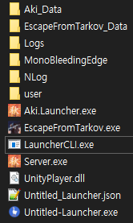
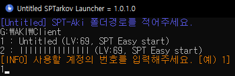

[AnsiEscapeCode]: https://en.wikipedia.org/wiki/ANSI_escape_code#Colors "Ansi Escape Code Colors"
[kernel32]: https://ko.wikipedia.org/wiki/%EC%9C%88%EB%8F%84%EC%9A%B0_%EB%9D%BC%EC%9D%B4%EB%B8%8C%EB%9F%AC%EB%A6%AC_%ED%8C%8C%EC%9D%BC#KERNEL32.DLL "kernel32.dll 정보"
[.Net5.0]: https://dotnet.microsoft.com/ko-kr/download/dotnet/thank-you/runtime-aspnetcore-5.0.17-windows-x64-installer ".Net 5.0 다운로드"

# Untitled-Launcher (Simple Launcher)

[.Net 5.0][.Net5.0] 이 필요합니다.

---

## 주의사항

* Server.exe혹은 EscapeFromTarkov.exe가 관리자 권한으로 실행옵션이 되어있다면. 해당 프로그램도 관리자 권한으로 실행되어야합니다

* 아래와 같은 위치에 프로그램을 넣어두시면 됩니다.

* 다른 위치에서 실행시 SPT-AKI 위치를 입력해주면 됩니다. (실행시 입력창이 나옵니다.)



```json
{
  "SPT_Path": "",
  "ProfileID": "",
  "AutoClose": true
}

SPT_Path = SPT-AKI 경로 (Server.exe와 EscapeFromTarkov.exe가 있는 폴더)
ProfileID = ProfileID (자동으로 접속할 프로필 ID user\\profiles 폴더속 json파일의 이름이 ID입니다.)
AutoClose = Server.exe를 종료하면 EscapeFromTarkov.exe도 같이 종료할지 여부입니다. (true일시 자동종료)
```

---

실행경로에서 서버파일을 발견하면 자동으로 실행하며 다른 경로에서 실행시 SPT-Aki 경로를 입력해야됩니다.

그후 미리 생성해둔 프로필을 입력하면 됩니다.



서버가 준비되면 EscapeFromTarkov.exe를 실행합니다.


프로필 로딩(인게임 메뉴화면 표시 되는 시점) 이 되면 로딩 완료 메세지와 로딩시간이 표시됩니다.


---

[Untitled-Launcher 다운로드](https://github.com/Untitled0828/SPT-Launcher/releases "릴리즈 버전 다운로드")

---

* 해당 프로그램은 Server.exe의 출력 값을 가져와 다시 출력하는 과정에서 [Ansi Escape Code#Color][AnsiEscapeCode] 표현을 위해 [kernel32.dll][kernel32] 를 사용합니다.
