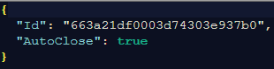
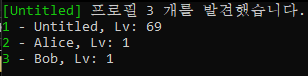
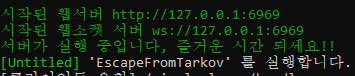

# Untitled - Simple Launcher

* Ver - 1.0.0.0

* `24.05.26

## 프로그램 정보

* Aki.Server와 Aki.Launcher의 기능을 하나의 프로그램만 실행해도 가능하게 만들었습니다.

* 단 계정을 생성하는 기능은 없기때문에 최초 설치시 Aki.Launcher로 계정을 만들어주셔야 합니다.

---

Config

`SimpleLauncher.json`

AutoClose: 서버창을 종료할시 클라이언트를 같이 종료합니다. (기본 값: false)

---

프로필 번호를 입력하여 사용할 계정을 선택합니다. (추후 실행시 해당 계정으로 자동실행)

서버가 준비되면 지정한 계정으로 클라이언트를 실행합니다.

---

[런처 다운로드](https://github.com/Untitled0828/SPT-Launcher/raw/main/file/SimpleLauncher-1.0.0.0.7z "SPT-AKI SimpleLauncher Download")

